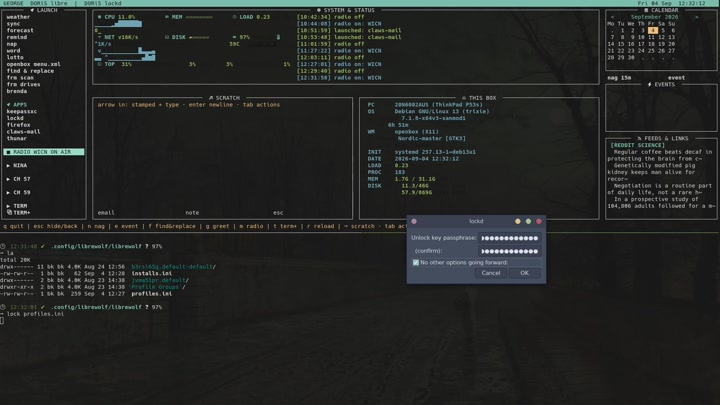
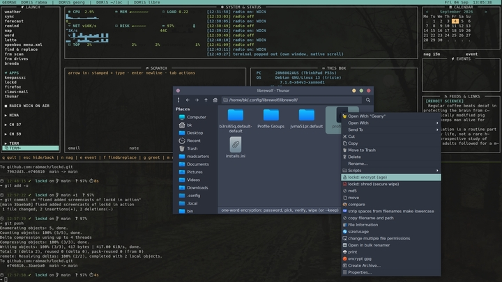

# lockd — lazy, kind encryption for regular humans


One word encrypts a file or a directory. `age` does the cryptography
(Debian-packaged, MIT, modern); lockd does the *everything else* — the part
that has kept regular people from encrypting anything for decades.

[](https://github.com/user-attachments/assets/43247bdc-fa3a-42a3-826e-e79db5341cc5)

```
lockd                        → pick file(s) → password → done
lockd somedir                → the directory becomes one archive, locked
lockd -d thing.age           → unlock it
lockd --keep                 → encrypt but never wipe the originals
lockd --fast                 → this run: no offers, just lock it
lockd --selftest             → prove the roundtrip, headless
```

## THE RULE

**The original is wiped by default.**

1. lockd encrypts.
2. lockd decrypts the ciphertext back and byte-compares it against the
   original.
3. Only on a perfect match does it shred the original.
4. If verification fails for *any* reason: the original survives, the bad
   ciphertext is destroyed, and lockd says so loudly.

`--keep` skips the wipe for the faint of heart. No flag ever skips the
verification.

## The first run

No default key? lockd makes one (passphrase-protected, living at
`~/.config/lockd/identity.txt`) and remembers it. From then on, the password
you type unlocks that key. Your public key gets offered to the clipboard and
to a Place of your choosing.

[](https://github.com/user-attachments/assets/dbd00926-2615-418f-ba5d-03d2fdc552f4)

## Fast, clean, out of your face

The password window carries a checkbox: **"No other options going forward"**.
Check it once and lockd's offers go away forever — encrypt, verify, wipe,
done. (`lockd --full` brings the offers back for one run.)

## Places

The "what now?" offers read your GTK bookmarks (`Places` in Thunar) — copy
the locked file to any of them with one pick, or hand it to claws-mail.

## Requirements

Stock Debian: `age` (apt), `yad`, `xclip`, `script`, `shred` — all in the
repos, nothing exotic, nothing compiled.

## Phase 2 (parked on purpose)

**Encrypted email-to-self** — lock the file, your mail client attaches
the `.age`, and the mailbox becomes a backup the provider cannot read
(claws-mail leads; mutt from the CLI; evolution/kmail later). Mail
**signing** is a different animal: age keys cannot sign — that's
deliberate in age's design — so signing stays with OpenPGP/gpg in your
mail client, where it already works. Plus: contact-card (vcf) key
sharing, keybind (the installer sets **Ctrl+Alt+E** on openbox). The name: yes, the kernel's NFS `lockd` owns that
string in some contexts — accepted; nothing collides at the binary
level. And in george, lockd is a chip: one line in `buttons.toml`.

## License

MIT
